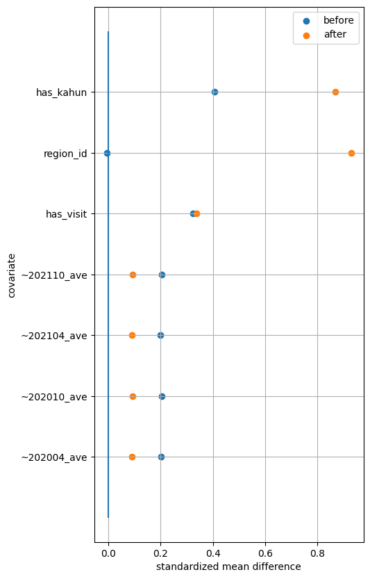
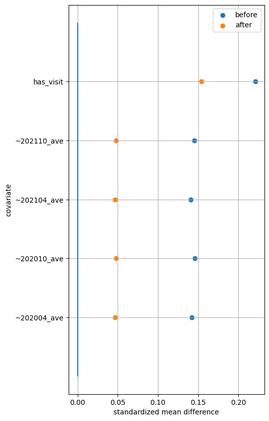

# 課題: MR君来期継続受注に向けた提案作成

**課題概要**
MR君来期継続受注に向けた提案作成
- 1今期MR君実施による製薬企業からみた投資対効果 (ROI)
- 2来期PJに向けた改善点に関してファクト・施策案 
を示すこと

**課題内容**
来期継続提案に向けた分析を行い、最終報告をする
- 背景）薬剤Aに関するMR君を6ヶ月間実施したクライアントから、継続判断材料として、定量的なファクトを示すことを求められている
- 条件）今期PJ期間2021/11~2022/04で、PJ費用合計8000万円  
※既読課金費用上記PJ費用に含まれるとしてください
- <u>前提）CL報告に先駆け、まずエムスリー社内営業担当・及びデータ分析グループ向けに分析結果を報告する想定である</u>
    - 営業担当クライアントに直接コミュニケーションをとる立場である 
    - 営業担当データ分析専門家でない  
    ※インターンでデータ分析グループメンバーに対して報告する
***
# 目次
* $ROI$の導出方法
* データの詳細
* $ATT$と$ROI$を計算
* 適切に共変量を選択した上での$ATT$と$ROI$
* 来期PJに向けた改善点の検討
* 北海道に絞って改善施策を考える
***
# $ROI$の導出方法

今回はMR君を利用する際の$ROI$を出すことが目的の一つであるので，まず**処置群における平均処置効果**：$ATT$を推定する.  
そして$ATT$×**病院数**によって$Return$を出す．$Investment$は80,000,000であるので，この値でReturnを除することでROIを求める.  
インディケータ変数を$Z$，共変量を$X$として，傾向スコア$e(xi)$を以下のように定義して，ロジスティック回帰で導出する．  

$e(x_i) = Pr(Z_i = 1 | X_i = x_i)$

この傾向スコアを用いて，逆確率重み付け法($IPW$)を用いることで，結果変数を$Y$として，以下の式によって$ATT$を求めることができる.  

$ATT = E(Y_1|Z=1)-E(Y_0|Z=1) =  \bar{y_1}  -\dfrac{\sum_{i=1}^N\frac{(1-z_i)e_i}{1-e_i}y_i }{\sum_{j=1}^N\frac{(1-z_j)e_j}{1-e_j}}$  
$ROI = \dfrac{Return}{Investment} = \dfrac{ATT × 病院数}{80000000}$
***
# データの詳細

| 特徴量     | 説明 |
|:-------------:|:---------:|
| <u>hospital_id<u/> | <u>病院のID<u/>        |
| ~202004_ave | 2020年4月までの半年間の平均売り上げ        |
| ~202010_ave | 2020年10月までの半年間の平均売り上げ        |
| ~202104_ave | 2021年4月までの半年間の平均売り上げ        |
| ~202110_ave | 2021年10月までの半年間の平均売り上げ        |
| ~202204_ave | 2022年4月までの半年間の平均売り上げ        |
| dr_count    | 病院に所属する医師の数        |
| send_count  | 送ったメッセージの数        |
| read_count  | 既読メッセージの数        |
| has_mrkun   | メッセージの既読有無        |
| has_kahun   | アレルギーに関わる診療科に所属している医師の有無        |
| has_visit   | MRの訪問有無        |
| region_id   | 病院の所在地        |

今回はこれらの特徴量に注目しており，$Z$をメッセージの既読有無:`has_mrkun`，$Y$を2022年4月までの半年間の平均売り上げ:`~202204_ave`　とした.  
その上で以下では **「強く無視できる割り当て」条件** が成り立つように共変量を選択しながら$ATT$を導出した．
***
# $ATT$と$ROI$を計算

まずは，メッセージの既読有無の上流にあるメッセージの数や医師の数を取り除いて$ATT$と$ROI$を求めた．結果は以下の通りである．  

$ATT$ = 18872

$ROI$ = 11.8

この妥当性を確認するために標準化平均差（$SMD$）によって共変量を確認した  

その結果，地域(`region_id`)と花粉アレルギーの診療科(`has_kahun`)の有無の$SMD$が増加しているため，共変量として使用すること見直す必要があることがわかった．  
   

また決定係数について，結果変数とインディケータ変数と各共変量についてそれぞれ回帰分析を行い調べたところ以下のようになった．  

**2022年4月までの半年間の各月売り上げ平均`~202204_ave`と各共変量**
| Name        | R_squared             |
|-------------|-----------------------|
| **<u>region_id</u>**   | <u>0.001335</u> |　　
| **<u>has_kahun</u>**   | <u>0.001829</u> |
| has_visit   | 0.072365    |
| ~202010_ave | 0.948677    |
| ~202110_ave | 0.949943    |
| ~202004_ave | 0.953954    |
| ~202104_ave | 0.954522    |

**メッセージの既読有無`has_mrkun`と各共変量**
| Name        | R_squared           |
|-------------|---------------------|
| has_kahun   | 0.06344 |
| has_visit   | 0.07603 |
| ~202010_ave | 0.08687 |
| ~202110_ave | 0.08693  |
| ~202004_ave | 0.08726 |
| ~202104_ave | 0.08740 |
| region_id   | 0.09915 |

この結果と$SMD$の結果を踏まえ，`has_kahun`と`region_id`を切り分けることで，「強く無視できる割り当て」条件において$ATT$を求めることができると考えた．

***
# 適切に共変量を選択した上での$ATT$と$ROI$
地域・アレルギーに関わる診療科に所属している医師の有無で分けてそれぞれ$ATT$を導出後，$ROI$を計算した

上記の条件でATTを導出し地域毎にまとめたものが以下の通りである  
| region | return    | hos_count | $ATT$| effect_%            |
|:--------:|:-----------:|:-----------:|:------------:|:---------------------:|
| 北海道 | -45128844 | 1960      | -23024     | -18.94 |
| 東北   | 129962649 | 3662      | 35489      | 34.61    |
| 関東   | 136412072 | 16147     | 8448       | 7.30   |
| 中部   | 360341812 | 8059      | 44712      | 42.35   |
| 近畿   | 273553174 | 8808      | 31057      | 32.09   |
| 中国   | -4549752  | 3546      | -1283      | -1.73 |
| 四国   | 17952308  | 1734      | 10353      | 8.88   |
| 九州   | 452217    | 6456      | 70         | 0.12 |

この結果を元にして$ROI$を求めた結果以下のようになった  
$ROI$ = 10.8

また標準化平均差（SMD）によって共変量を確認したところ，いずれの共変量も下がっていた

### 以上を踏まえて，MR君を用いることによる$\color{red}ROI$は10.8となると考えられる．
***
# 来期PJに向けた改善点の検討
北海道，中国，九州でのMR君の効果が薄いことがわかった  
特に北海道での効果が負の方向に大きくなっていることから改善に取り組む必要があるものと考えられる．
| region | kahun | return    | hos_count | $ATT$ | effect_%             |
|:--------:|:-------:|:-----------:|:-----------:|:------------:|:----------------------:|
| 北海道| 0     | -89,516    | 687       | -130       | -0.13 |
|  | 1     | -45,039,327 | 1,273      | -35,380     | -26.47  |
| 東北   | 0     | 22,359,288  | 1,373      | 16,284      | 20.18   |
|    | 1     | 107,603,361 | 2,289      | 47,008      | 40.65    |
| 関東   | 0     | 59,458,346  | 5,709      | 10,414      | 12.71   |
|    | 1     | 76,953,725  | 10,438     | 7,372       | 5.49    |
| 中部   | 0     | 64,613,256  | 2,969      | 21,762      | 33.93    |
|    | 1     | 295,728,556 | 5,090      | 58,099      | 44.78    |
| 近畿   | 0     | 129,894,472 | 3,156      | 41,157      | 62.88   |
|    | 1     | 143,658,702 | 5,652      | 25,417      | 22.24   |
| 中国   | 0     | 14,055,987  | 1,235      | 11,381      | 19.64   |
|    | 1     | -18,605,739 | 2,311      | -8,050      | -9.75   |
| 四国   | 0     | 348,534    | 518       | 672        | 0.48  |
|    | 1     | 17,603,774  | 1,216      | 14,476      | 13.56   |
| 九州   | 0     | 8,441,700   | 2,316      | 3,644       | 7.57   |
|    | 1     | -7,989,482  | 4,140      | -1,929      | -3.22   |

***

北海道に絞って改善施策を考える

まずは北海道と他の地域との違いを平均値によって確認する.  
それをまとめたものが以下の通りである.  

| region | has_kahun | dr_count           | send_count         | read_count         | has_mrkun           | has_visit           |
|:--------:|:-----------:|:--------------------:|:--------------------:|:--------------------:|:---------------------:|:---------------------:|
| 北海道 | 0.0       | 1.07 | 23.69 | 10.48 | 0.27 | 0.22 |
|  | 1.0       | 11.70 | 136.77 | 57.10 | 0.50  | 0.24 |
| 東北   | 0.0       | 1.05 | 19.16  | 7.92  | 0.20 | 0.17 |
|   | 1.0       | 7.07  | 85.90  | 34.39 | 0.36 | 0.21 |
| 関東   | 0.0       | 1.03 | 19.97  | 7.71  | 0.21 | 0.21 |
|    | 1.0       | 14.15  | 160.28 | 65.15  | 0.43   | 0.26  |
| 中部   | 0.0       | 1.01 | 20.12 | 8.36   | 0.22 | 0.20 |
|    | 1.0       | 8.68  | 103.65 | 42.32  | 0.39 | 0.24 |
| 近畿   | 0.0       | 1.05   | 21.01  | 8.63  | 0.23 | 0.16  |
|    | 1.0       | 7.39  | 91.07  | 38.11  | 0.39 | 0.21 |
| 中国   | 0.0       | 1.06 | 22.61 | 8.95  | 0.24 | 0.16 |
|    | 1.0       | 9.91  | 116.98  | 47.02  | 0.41 | 0.18 |
| 四国   | 0.0       | 1.29 | 25.37  | 9.91  | 0.27 | 0.20 |
|    | 1.0       | 12.03 | 135.88 | 55.85  | 0.43 | 0.19 |
| 九州   | 0.0       | 1.034 | 20.67 | 7.93  | 0.21 | 0.13 |
|    | 1.0       | 8.82  | 105.11 | 43.55  | 0.41  | 0.17 |

**北海道の特徴**
- 既読メッセージの数は変わらない
- メッセージの既読有無の割合は他の地域よりも高い

→MR君は他の地域と同じかそれ以上に浸透している  
→それなのに$ATT$が低い  

**なぜ$ATT$が低いのか**  
→そもそも北海道に花粉症患者が少なく，花粉症用の薬剤の需要が少ない  
→既読の課金だけが増えていくが売上にはつながらない  
→$ATT$が下がる  

**施策**
薬剤の売上につながり辛い医師にメッセージを送るのを控える  
→募集をかける医師群を絞る
***
募集をかける医師群を絞った際の$ROI$の向上を確認するために，北海道における$ATU$を求めた.  
$ATU$は以下のようにして求めることができる  

$ATU = E(Y_1|Z=0)-E(Y_0|Z=0) =    \dfrac{\sum_{i=1}^N\frac{z_i(1-e_i)}{e_i}y_i }{\sum_{j=1}^N\frac{z_j(1-e_j)}{e_j}}-\bar{y_0}$

これに基づいて，北海道の$ATU$を求めたところ以下のようになった  
$ATU$ = 11971  
したがって，これに基づいて$ROI$を新たに求めると以下のようになった  
$ROI$ = 11.6  
これは$ROI$が10%改善されたことを示しており，  
募集をかける医師群を絞ることでメッセージの既読課金の費用を減らすことができ，ROIが上がることが示唆された.